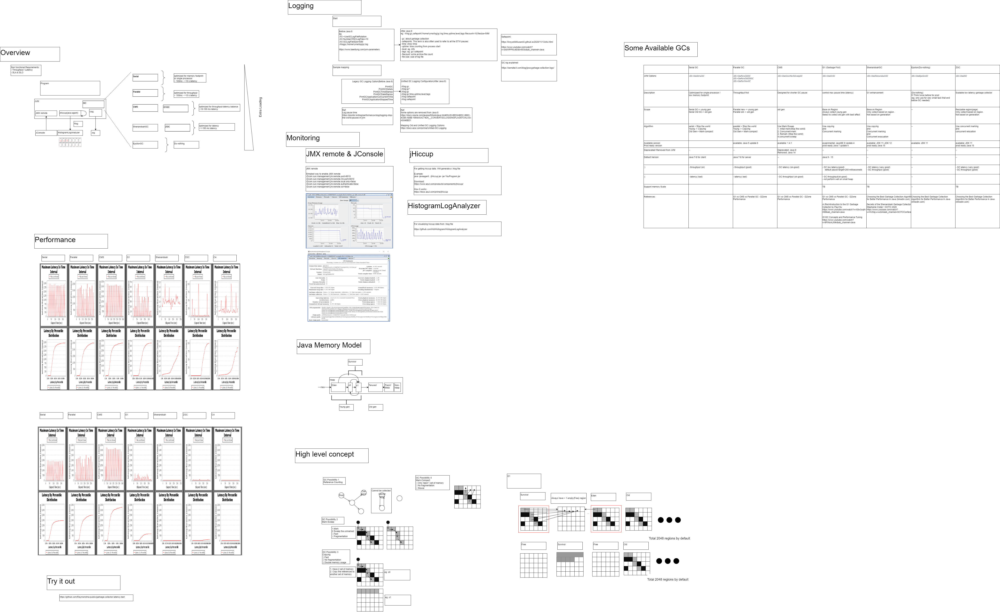

# Background
* This repo is intended to let you try out different garbage collector
* For more detail, please refer to the [GC-cheatsheet](GC-cheatsheet.pdf)

# Prerequisite
* Install the jdk you want to test
* Edit `run.sh` to modify your jdk paths

# Try with it
* Modify the `TestPauseTime.java` to test with your logic
* Run `./run.sh "test-case-name"` to build the jar and run your test case
  * e.g. `./run.sh "test-gc-1"` 
* The results will be generated under `results/test-case-name`

# Visualization
* Run `HistogramLogAnalyzer-1.0.4-SNAPSHOT.jar`
* Drag the `.hlog` files under your test into Histogram Log Analyzer to visualize and analyze the result

# GC Overview

# Reference
* Azul Platform Prime download
  * https://www.azul.com/products/prime/stream-download/
* Azul jHiccup
  * https://www.azul.com/products/components/jhiccup/
* Histogram Log Analyzer
  * https://github.com/HdrHistogram/HistogramLogAnalyzer
